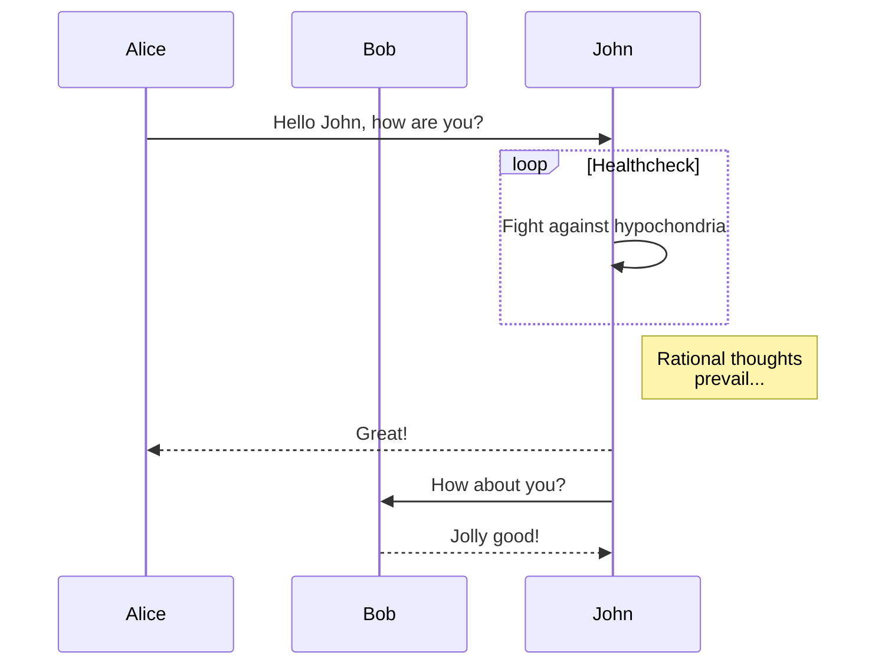

写文章时，你是否被Word各式各样的标题、正文、引用样式搞得晕头转向？

你是否在不断地调整样式，修改大纲中感到疲惫厌倦？

想快速便捷地写一篇排版清晰的文章吗？

那就快来试试`Markdown`！

<!-- more -->

## 什么是Markdown

> `Markdown`是一种轻量级标记语言，排版语法简洁，让人们更多地关注内容本身而非排版。
> 它使用易读易写的纯文本格式编写文档，可与`HTML`混编，可导出 `HTML`、`PDF` 以及本身的 `.md` 格式的文件。
> 因简洁、高效、易读、易写，`Markdown`被大量使用，如`Github`、`Wikipedia`、`简书`等。
> [Markdown中文文档](https://markdown.com.cn)

`我的所有文章都是用Markdown语法写的`

## 如何使用Markdown

> 由于有大量免费工具的存在，上手 Markdown 是很方便的。
> 比较遗憾的一点是各平台可能采用不同语言实现的 Markdown 解析引擎，或采用同一解析引擎的不同版本，而且可能有不同程度的定制与扩展，这导致在不同平台上使用 Markdown 写作时体验并不完全一致。
> 不过幸好对于大家公认的一些标准语法，各家都是支持的。

这里提供一个[在线Markdown编辑器](https://markdown.com.cn/editor/)，以最简单的方式使用`Markdown`

## 怎么写Markdown

由于网络上已经有了太多的Markdown文档，我再写一篇是一件费力不讨好的事

我这里就推荐一些Markdown好用的工具，点击标题即可跳转

带`⭐`就是我极力推荐的工具

### 网站

#### [CommomMark](https://commonmark.org/) ⭐

`CommomMark`是一可视化的`Markdown`学习网站，它的`Learn Markdown in 60 Seconds`真的让我眼前一亮

如果你会一点点英语，就可以流畅地使用这个网站，并快速学会`Markdown`大部分语法

#### [Markdown教程](https://markdown.com.cn/)

`Markdown教程`是一篇Markdown的中文文档，内容详细，且提供了许多有用的工具，包括在线编辑器，语法速查表

### 软件

#### [Typora](https://typoraio.cn/)

`Typora`无疑是公认最好用的`Markdown编辑器`，功能丰富简单好用

不过`Typora`专业版是要付费的

#### [Obsidian](https://obsidian.md/) ⭐

`Obsidian`是个<big>非常</big><big><big>非常</big></big><big><big><big>非常</big></big></big>强大的`开源笔记本软件`

它原生支持`Markdown`、`mermaid`、`dataview`、`yaml`等语法

在`Markdown`编写中，对比`Typora`的实时预览，`Obsidian`采用的是所见即所得的渲染方式，各有千秋吧

同时有庞大的开源社区支撑，有许多Amazing的插件

这也是我最喜欢，现在还在用的笔记本软件

<small>~~有时间写一篇Obsidian教程…………~~</small>

## Mermaid使用

`Mermaid`是一个类似Markdown的脚本语言，`Markdown`用于渲染文字，而`Mermaid`用于渲染图表

`Markdown`和`Mermaid`是相辅相成的

不过对没有图表绘制需求的用户来说，`Mermaid`是不必要的

举例：

不要嫌弃长得丑，其实`Mermaid`本来很好看的，只不过我的网站没写好…………

这里再提供一点`Mermaid`工具

### 网站

#### [Mermaid官网](https://mermaid.js.org/)

官网就是官网，内容最全的地方，只不过不知道为什么没汉化

反而是Github的readme有汉化 [mermaid/README.zh-CN.md](https://github.com/mermaid-js/mermaid/blob/develop/README.zh-CN.md)

#### [Mermaid Live Editor](https://mermaid.live/) ⭐

`Mermaid官方`提供的在线编辑器

官方就是官方，功能最全的地方，只不过不知道为什么没汉化

#### [Mermaid在线|菜鸟工具](https://www.jyshare.com/front-end/9729/)

[菜鸟教程](https://www.runoob.com/)是我很喜欢的一个编程学习网站，它有丰富的教学文档和在线工具

`Mermaid在线绘图工具`就是其便利的冰山一角

### 软件

##### [Typora](https://typoraio.cn/)

##### [Obsidian](https://obsidian.md/) ⭐

是的，他们俩都支持`Mermaid`

这也是为什么我说`Markdown`和`Mermaid`是相辅相成的

因为一般支持`Markdown`的软件必有`Mermaid`支持